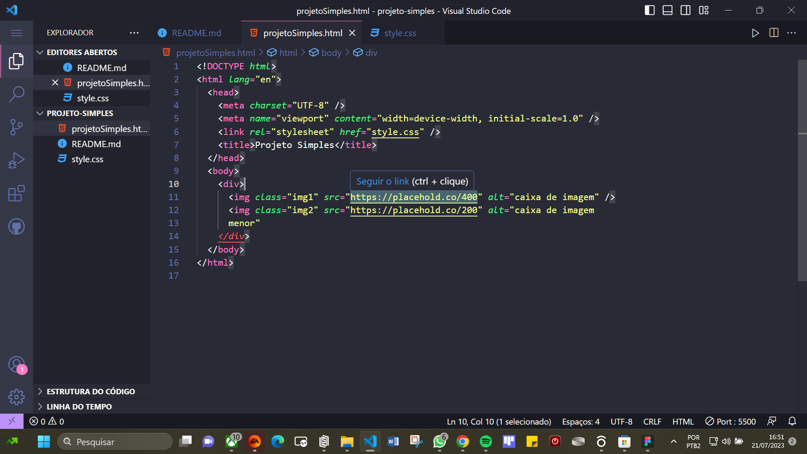
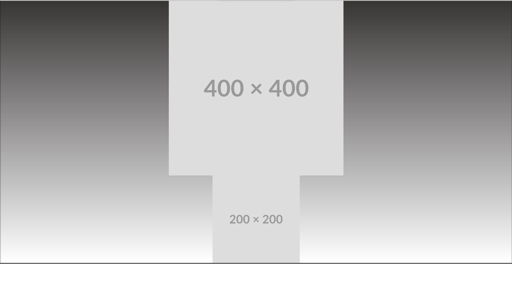

# projeto-simples

Um projeto básico usando o conceito de display flex,align-itens
Foi usado esses conceitos para podermos estilizar com maior liberdade e organização
Lembre-se de usar div's ou conceitos semelhantes no codigo "pai" para estilizar o "filho"

O css foi importado através do link para deixar o código mais organizado

aqui está alguns prints para visualizar melhor as informações

